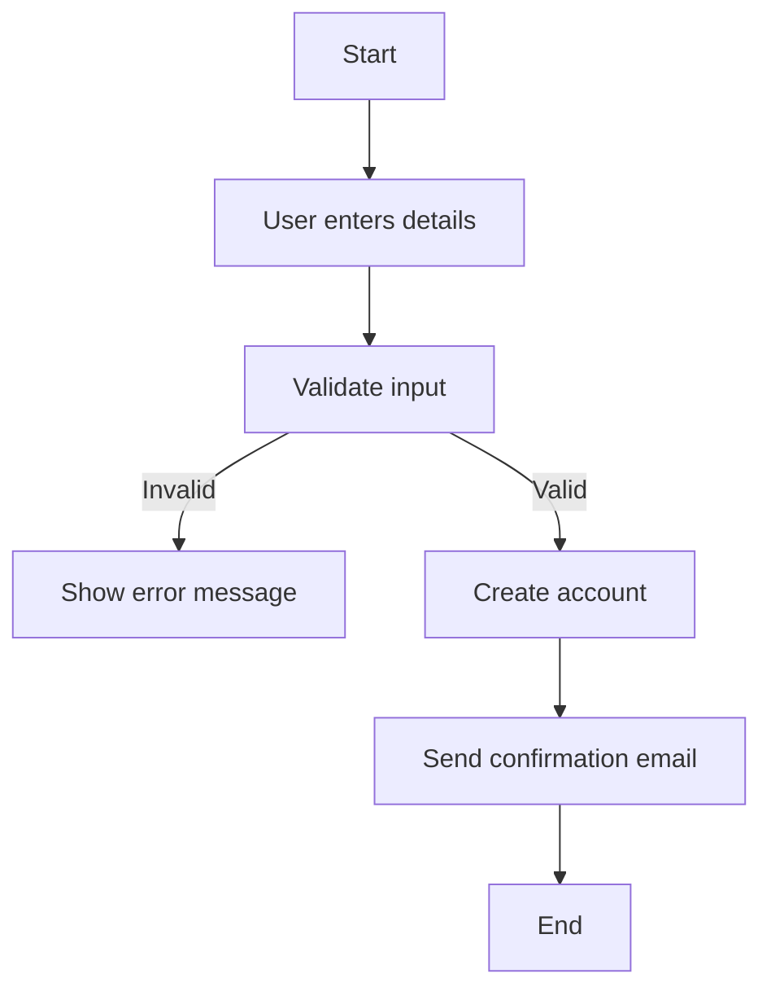
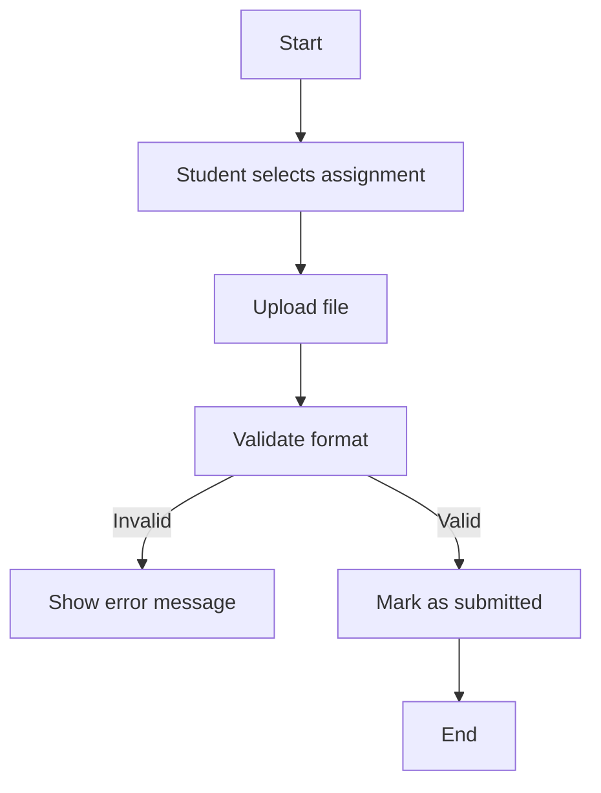

## 2. Activity Workflow Modeling with Activity Diagrams 

### **2.1 Student Registration Workflow**

**Explanation:**
- Users enter registration details.
- If invalid, an error message is shown.
- If valid, the account is created, and an email is sent.

---

### **2.2 Submit Assignment Workflow**

**Explanation:**
- A student selects and uploads an assignment.
- If the format is invalid, an error is shown.
- If valid, the assignment is **Submitted**.
